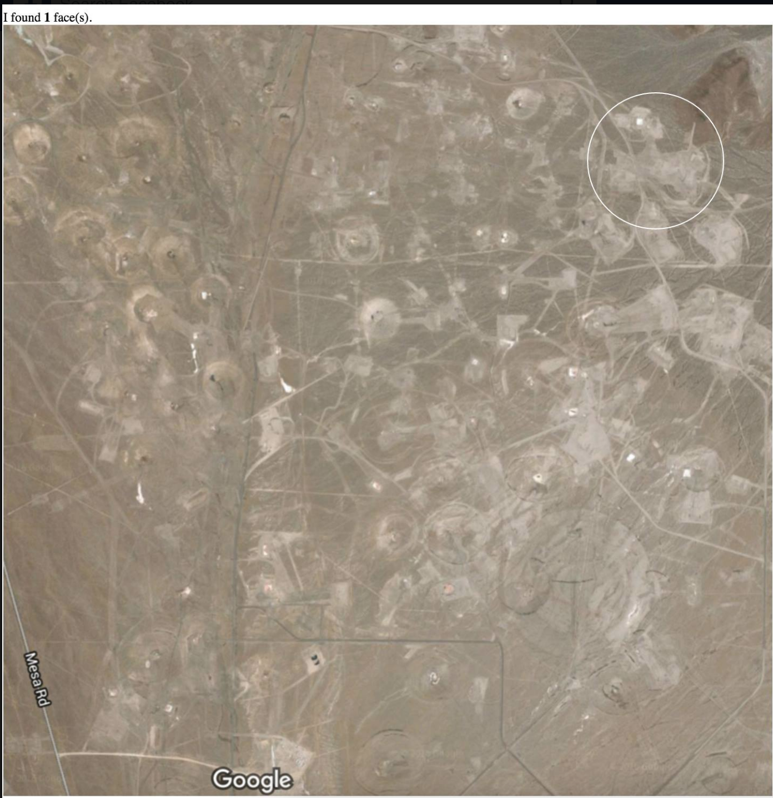

# crater-pareidolia
Finding faces in craters left in Nevada from Atomic Tests.  
The Nevada National Security Site, previously the Nevada Test Site (NTS), is a United States Department of Energy reservation located in southeastern Nye County, Nevada, about 65 miles (105 km) northwest of the city of Las Vegas. Formerly known as the Nevada Proving Grounds,[2] the site was established on 11 January 1951 for the testing of nuclear devices, covering approximately 1,360 square miles (3,500 km2) of desert and mountainous terrain.

